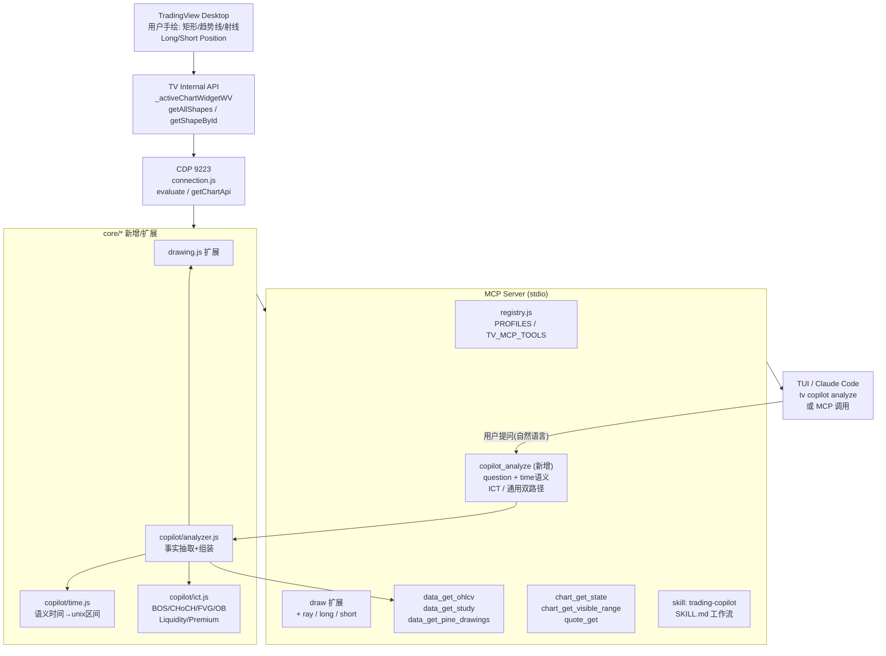
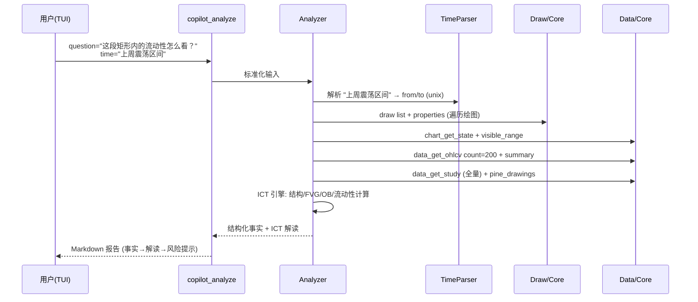

# WIP: Trading Copilot — 图表绘图+语义分析+ICT 客观分析（分支: feature/trading-copilot）

## 需求与意图

> 用户原话要点：用户在 TradingView 开启 CDP 模式下，用 TV 内置工具绘制 矩形/趋势线/射线/short position/long position，以及用语义描述（大概时间区间/某一根K线）提问，Copilot 根据上下文 + 图表中的指标/绘图 抽取相关数据和事实K线做客观分析；未指定策略时默认用 ICT 概念分析。大部分 tool/mcp 已有，缺的补上，自主制定测试与 skill，允许 subagent 并行。初版仅支持“用户在 app 绘图 → TUI 调 MCP 分析”，其他形态评估后决定。

**验收标准（初版 MVP）：**
- [ ] 用户在 TV 手绘 `rectangle / trend_line / ray / long_position / short_position` 后，`draw action=list + properties` 能完整读回坐标/价格
- [ ] TUI 中 `tv copilot analyze "问题"` 或 MCP `copilot_analyze` 能回答，用户可用自然语言指定时间语义（`“上周那段震荡” / “2025-08-20 那根大阴线” / “最近 50 根”`）
- [ ] 分析输出 = 客观事实（OHLCV + 指标读数 + 绘图事实）+ 基于 ICT 的结构化解读（BOS/CHoCH、FVG/OB、Liquidity、Premium/Discount），不做喊单式主观预测
- [ ] 未指定策略时自动走 ICT 路径；指定则按用户策略上下文分析
- [ ] 新增 `skill: trading-copilot` 完整工作流，`tests/*` 覆盖核心逻辑
- [ ] `pnpm test:unit` 全绿，`pnpm lint` 全绿

**非目标（本期不做）：**
- 不在 TV 内嵌 UI 悬浮窗（仅 TUI/MCP）
- 不自动下单/不做实盘交易
- 不做多 Tab/多 Pane 自动联动（评估后二期）

---

## 上下文与依赖

**技术底座：**
- `CDP 9223 → connection.js → core/* → tools/* → registry.js → server.js (stdio MCP)`
- `core/drawing.js` 已支持 `createShape / createMultipointShape` + `getAllShapes / getShapeById`，但 tool 层 `draw` 仅暴露 5 种 shape（`horizontal_line / vertical_line / trend_line / rectangle / text`），**缺 `ray / long_position / short_position / fib / parallel_channel`**
- `core/data.js` 已有 `getOhlcv / getStudyValues / getStudySeries / getPineLines/Labels/Tables/Boxes / getQuote`，可拿 K 线、指标、Pine 图形
- `stream.js` 未暴露为 MCP，但提供 `pollLoop` 实时订阅能力，二期可用
- `wait.js` 提供 `waitForChartReady / waitForChartRender` 稳定探针

**现有可复用资产：**
- skills: `chart-analysis`（全流程分析模板）、`multi-symbol-scan`（跨品种）、`strategy-report`（策略报表）、`pine-develop`、`replay-practice`
- tests: `e2e.test.js` (70 工具)、`chart_*.test.js`、`launch.test.js`、`registry.test.js` 等

**依赖/风险：**
- 图表内部 API `window.TradingViewApi._activeChartWidgetWV.value()` 未文档化，TV 升级可能 break（同现有免责）
- `long_position / short_position` 的 API 点位为 3 点（入场/止损/止盈），需实测 `createMultipointShape` 参数形状
- 语义时间解析无现成库，需自写轻量 parser

---

## 当前状态

- [x] 已完成: 分支 `feature/trading-copilot` 创建，主分支进展盘点，现有能力摸底，计划草案 + 用户评审（2026-08-29）
- [x] 已确认: 7 个待讨论问题全部拍板（见决策记录）
- [x] 已完成: Goal1 底座 — 绘图扩展(ray/long/short/points)+time(NY)+context(并行) (`944e4b4`)
- [x] 已完成: Goal2 引擎 — ICT 6模块+Analyzer(含免责/多周期按需/视觉回写)+copilot_analyze MCP/CLI+registry (`4512456`)
- [x] 已完成: Goal3 Skill/测试/验收 — SKILL.md + 5个测试(229 passed) + lint/tools:report 全绿
- [x] 已完成: 真机验收阻塞排障 — TV Wayland 分数缩放 resize 死锁，X11 方案修复并固化（见决策记录 2026-08-31）
- [ ] 进行中: 用户按验收清单走 A-D 四场景（TV 已可用，`tv copilot analyze` 待真机演示）

---

## 总体架构



**数据流（一次分析）：**



---

## 详细设计

### 1. 绘图能力补齐（P0 - 阻塞）

**现状缺口：** `src/tools/drawing.js` 的 `shape` 是 `z.string()` 但文档与 handler 仅列 5 种；`src/core/drawing.js` 按 `point2` 有无分发 `createShape` vs `createMultipointShape`，实测 `ray` 是单点+方向，`long_position/short_position` 是 3 点（entry/stop/take）。

**设计：**
- `core/drawing.js`:
  - `SHAPE_DEFS = { horizontal_line:1, vertical_line:1, trend_line:2, ray:2, rectangle:2, long_position:3, short_position:3, text:1, ... }` 校验点数
  - `drawShape` 扩展为支持 `points: [{time,price}...]` 数组，兼容旧 `point/point2`，新增 `points` 参数；对 3 点形状用 `createMultipointShape(points, {shape})`
  - `listDrawings` 增强：除 `id,name` 外，尝试 `getPoints()` 预取 points 数量，避免 N+1 查询（可选 `with_points=true`）
  - `getProperties` 已有 `getPoints/getProperties/isVisible`，对 long/short 解析 `entry/stop/price` 语义
- `tools/drawing.js`:
  - `draw` schema 新增 `points?: {time,price}[]`，`shape` 改 `z.enum([...])` 或保留 string + 运行时校验，更新 description 列出新增类型
  - 保持 `legacy` 兼容

**验证：** 在 TV 中手绘每种形状→ `draw action=list` → `action=properties` 读回点位比对

---

### 2. 语义时间/单根K线 解析（P0）

**输入示例：**
- `“上周” / “最近50根” / “2025-08-20” / “2025-08-01 到 2025-08-15” / “昨天纽约开盘那段” / “那根大阴线”`

**设计：`src/core/copilot/time.js`**
```js
export function parseTimeSemantics(input, ctx)
// ctx: { now, timeframe, visibleRange, bars }
// 返回: { from, to, anchorBarIndex?, label, confidence, warnings }
```
- 规则优先级：显式 ISO 日期/区间 > 相对（最近 N 根 / 近 N 天）> 自然语言（上周/本月/昨天）> 模糊（“那根大阴线”→ 需配合 OHLCV 搜索）
- 模糊单根定位：`findBarBySemantics(ohlcv, desc)` — 关键词 `大阳/大阴/长影/放量` + 振幅阈值 + 成交量分位
- 兜底：解析失败 → 用 `chart_get_visible_range` 的当前视口 `from/to`，并在报告中提示
- 时区：统一 unix 秒，展示用本地 + `America/New_York` 双标注（ICT Killzone 需要）

---

### 3. 事实数据抽取层（P0）

**设计：`src/core/copilot/context.js`**
```js
export async function collectFacts({ timeRange, includeDrawings, includeIndicators })
// 并行拉取（Promise.allSettled）:
```
- `chart_get_state` → symbol/timeframe/indicators entity_ids
- `chart_get_visible_range` + `data_get_ohlcv count=300`（含 summary）
- `data_get_study`（全量）→ 若实体数少，对关键指标 `getStudySeries count=100` 拉序列
- `draw list + properties`（仅在 includeDrawings 时，遍历前 20 个）
- `data_get_pine_drawings kind=line/label/box`（若有 Pine 指标）
- `quote_get`（实时价）
- 输出标准化 `facts = { symbol, timeframe, range, bars:[], indicators:{}, drawings:[], pine:{}, quote }`

**性能/上下文控制：** 默认 compact，bars 超 200 根截断 + 给 summary，drawings 超限给前 20 + 提示

---

### 4. ICT 分析引擎（P0 - 核心差异化）

**设计：`src/core/copilot/ict.js`**

> 默认策略：未指定策略 → 走 ICT；显式指定 → 走通用客观分析 + 可选 ICT 交叉验证

**ICT 模块（纯函数，输入 facts，输出结构化解读）：**

| 概念 | 输入 | 算法要点 | 输出 |
|---|---|---|---|
| 市场结构 | OHLCV (H/L) | 滑动窗口找 swing high/low（pivot 左右 N 根），检测 BOS（Break of Structure）/ CHoCH | `structure: { trend:'bull/bear/range', swings:[], bos:[], choch:[] }` |
| 公平价值缺口 FVG | OHLCV | 检测 3 根 K 线 imbalance：`low[0] > high[2]` (bull FVG) / `high[0] < low[2]` (bear FVG)，过滤重叠 | `fvg: [{type, high, low, mitigated}]` |
| 订单块 OB | OHLCV + 结构 | CHoCH/BOS 前的最后一根反向 K 线，高/低 + 成交量确认 | `orderBlocks: [{type, zone:{high,low}, formedAt}]` |
| 流动性 | OHLCV (H/L) | 检测 Equal Highs/Lows（N 根内高点差 < ATR*0.1）、Buy/Sell Side Liquidity、Stop Hunt 影线 | `liquidity: { equalHighs, equalLows, bsl, ssl }` |
| 溢价/折扣 | 区间 H/L | 0-50% 折扣区 / 50-100% 溢价区 + OTE (62-79%) | `premiumDiscount: { discountZone, premiumZone, ote }` |
| Killzone | 时间 | NY Open (13:30-16 UTC)、London (07-10 UTC)、Asia 标注，匹配 bars 时间 | `killzones: [{name, from,to, barsInZone}]` |

**通用客观分析（非 ICT 路径）：**
- 支撑/阻力：基于绘制的 `horizontal_line / rectangle` + 历史高低点
- 趋势线有效性：`trend_line / ray` 的触碰次数、斜率、是否突破
- 仓位分析：`long_position / short_position` 的入场/止损/止盈 RR 校验

**输出规范：** 每个判断必须附 `证据 bars/drawings/indicator` 引用 + `置信度 low/med/high`，禁止无证据预测

---

### 5. Copilot 分析器与 MCP 工具（P0）

**新增工具：`src/tools/copilot.js` + `src/core/copilot/analyzer.js`**

```js
// tools/copilot.js
export const group = 'copilot'
export const tools = [{
  name: 'copilot_analyze',
  description: 'Trading Copilot — 结合图表绘图/指标/K线，对用户问题做客观事实分析。未指定策略默认 ICT。支持语义时间区间与单根K线定位。',
  schema: {
    question: z.string().describe('用户问题（自然语言）'),
    time: z.string().optional().describe('语义时间：如 "上周" / "2025-08-20那根大阴线" / "最近50根" / "2025-08-01 to 2025-08-15"'),
    use_ict: z.boolean().optional().describe('是否用 ICT 分析（默认 true，未指定策略时）'),
    include_drawings: z.boolean().optional().describe('是否纳入用户绘图（默认 true）'),
    include_indicators: z.boolean().optional().describe('是否纳入指标（默认 true）'),
    max_bars: z.coerce.number().optional().describe('最多分析 K 线数（默认 200，max 500）'),
  },
  handler: async (args) => analyzer.analyze(args)
}]
```

**`analyzer.analyze` 流程：**
1. `parseTimeSemantics` → timeRange
2. `collectFacts` 并行拉数据
3. 分支：`use_ict ? ict.analyze(facts) : generic.analyze(facts, drawings)`
4. 组装 Markdown 报告：
   ```
   # 事实摘要 (Facts)
   - 品种/周期/区间/当前价
   - 关键 K 线事实（高低/振幅/成交量）
   - 绘图事实（矩形区间、趋势线斜率、Long/Short RR）
   - 指标读数

   # ICT 解读（或通用解读）
   - 市场结构 + BOS/CHoCH
   - FVG / OB / Liquidity
   - Premium/Discount / Killzone

   # 与用户问题关联
   - 逐条回答 question 中的子问题，带证据引用

   # 风险与局限
   - 免责声明 + 不确定性说明
   ```

**CLI：** `src/cli/commands/copilot.js` → `tv copilot analyze "问题" --time "上周" --no-ict`

**Registry：** `DOMAINS` 追加 `copilot`，`PROFILES` 中 `full` 包含，`minimal` 不包含

---

### 6. Skill：trading-copilot（P1）

**路径：`skills/trading-copilot/SKILL.md`**

复用 `chart-analysis` 模板，新增：
- Step 0: 语义理解（question + time 解析）
- Step 1: 事实抽取（并行读绘图/指标/K线）
- Step 2: 选择分析路径（ICT vs 通用）
- Step 3: 生成报告 + 可选回写绘图（用 `draw action=shape` 标注 FVG/OB 到图上，供用户视觉确认）
- Step 4: 截图 `capture_screenshot region=chart` 二次确认

**提示词约束：** 要求 Agent “先调 `copilot_analyze` 再自由发挥”，避免绕过事实层直接编造

---

### 7. 评估的其他形态（二期）

| 形态 | 描述 | 成本 | 建议 |
|---|---|---|---|
| 自动绘图回写 | 分析后自动在图上画 FVG/OB 矩形 | 低（已有 draw） | ✅ MVP 做视觉确认（带验收） |
| 多周期联动 | 1h 结构 + 15m 入场 联合分析 | 中（需多次 ohlcv） | ✅ MVP 按需：用户提及多周期才触发 |
| 多品种扫描 | `batch_run` + copilot 批量 | 低 | 二期，复用 multi-symbol-scan |
| 实时流订阅 | `stream.js` 轮询推送 | 中 | 二期，需新 MCP 工具 |
| 语音/图片输入 | 截图 + VLM 分析 | 高 | 不做 |
## 工具/Skill/测试 清单

### 新增/修改文件

| 文件 | 动作 | 说明 |
|---|---|---|
| `src/core/drawing.js` | 修改 | 扩展 shape 点数校验与 `points[]` 支持 |
| `src/tools/drawing.js` | 修改 | schema 扩展 ray/long/short/points |
| `src/core/copilot/time.js` | 新增 | 语义时间解析 |
| `src/core/copilot/context.js` | 新增 | 事实并行抽取 |
| `src/core/copilot/ict.js` | 新增 | ICT 纯函数引擎 |
| `src/core/copilot/analyzer.js` | 新增 | 编排与报告组装 |
| `src/core/copilot/index.js` | 新增 | 导出 |
| `src/tools/copilot.js` | 新增 | MCP 工具 |
| `src/tools/registry.js` | 修改 | 注册 copilot domain |
| `src/cli/commands/copilot.js` | 新增 | CLI `tv copilot` |
| `src/cli/index.js` | 修改 | 注册 copilot 命令 |
| `skills/trading-copilot/SKILL.md` | 新增 | 工作流 |
| `tests/copilot_time.test.js` | 新增 | 时间解析单测 |
| `tests/copilot_ict.test.js` | 新增 | ICT 引擎单测（FVG/OB/结构） |
| `tests/copilot_analyzer.test.js` | 新增 | Analyzer 集成单测（mock core） |
| `tests/drawing.test.js` | 新增 | 绘图扩展单测 |

### 测试计划（自主制定）

**单测（无需 TV，可 CI）：**
- `copilot_time.test.js`: 20+ 用例 — `“上周” / “最近50根” / “2025-08-20” / “那根大阴线” / “昨天NY开盘” / 兜底`，边界：空串、非法、跨年
- `copilot_ict.test.js`: 构造 OHLCV 数组 — FVG 检出、BSL/SSL、BOS/CHoCH、OTE、空数据、单根
- `copilot_analyzer.test.js`: mock `collectFacts` → 校验报告包含 facts+ict+question 关联 + 置信度
- `drawing.test.js`: 1点/2点/3点形状校验，错误点数抛错

**集成/e2e（需 TV CDP，本地）：**
- 手绘 5 种形状 → `draw list/properties` 回读
- `copilot_analyze question="分析这个矩形内的流动性"` + 真实 TV 图表（mock 数据兜底）
- CLI `tv copilot analyze --help` + `--json` 输出

**验收脚本：** `scripts/smoke-test.mjs` 新增 copilot tool 计数校验

---

## 里程碑与 Goal 拆解建议（待讨论后定）

> 建议拆 3 个 Goal，一口气做完，每 Goal 可并行 subagent

**Goal 1 — 绘图与数据底座（1-2 天）**
- 扩展 `drawing` 支持 ray/long/short + `points[]`
- 实现 `time.js` + `context.js`
- 单测 + e2e 手绘验证
- 交付物：`draw` 新形状可用，`collectFacts` 可并行拉全量事实

**Goal 2 — ICT 引擎与 Analyzer（2-3 天）**
- 实现 `ict.js` 六大模块 + `analyzer.js` 报告组装
- 实现 `copilot_analyze` MCP + CLI
- 单测覆盖核心逻辑
- 交付物：`tv copilot analyze "用ICT分析最近50根"` 可产出 Markdown 报告

**Goal 3 — Skill 与验收（1 天）**
- 编写 `skills/trading-copilot/SKILL.md`
- 补齐 `drawing.test.js` / `analyzer.test.js` / `smoke-test`
- 端到端演示：用户在 TV 画矩形+趋势线，TUI 提问 → 截图 + 报告
- 交付物：`pnpm test:unit` 全绿，演示录屏/截图

**并行策略：** Goal1 的 drawing 与 time 可分两个 subagent；Goal2 的 ict 与 analyzer 可分两个；验收 subagent 独立

---

## 风险与对策

| 风险 | 影响 | 对策 |
|---|---|---|
| `long_position` API 点位格式与文档不一致 | 绘图读取失败 | 预研阶段在真实 TV 上 `evaluate` 探针，`listDrawings` 打印 `getPoints()` 原始值 |
| TV 升级 break 内部 API | 全链路失败 | 复用现有 `healthCheck/discover` 探针，analyzer 中 `allSettled` 降级（缺失数据标 warning） |
| ICT 误判（假 FVG/OB） | 分析不可信 | 每个结论带 `confidence` + 证据引用 + 参数可调（pivot 长度、ATR 阈值），报告显式免责 |
| 上下文过大 | MCP 超限 | 默认 `max_bars=200` + compact，超限截断并提示 |
| 时间语义歧义 | 定位错区间 | 解析结果回显 `from/to + label` 让用户确认，低 confidence 时提示 |

---

## 待讨论问题

已全部拍板，无遗留。

---

## 下一步（接手指南）

1. Goal 1：绘图扩展 + time.js + context.js（本轮）
2. Goal 2：ICT + Analyzer + copilot 工具/CLI
3. Goal 3：Skill + 视觉回写 + 测试验收
4. 验证：`pnpm lint && pnpm test:unit` 全绿，`tv copilot analyze --help` 可见

## 决策记录

- 2026-08-31: **TV「一开 CDP 就卡死」排查结案** —— 与 copilot 代码/CDP 连接无关。根因：Electron 原生 Wayland + AMD(amdgpu) + Hyprland 分数缩放(1.875) 下，任何窗口 resize（退全屏/平铺抢空间）导致 GPU 线程死锁挂起（无 core dump，非 crash）。修复：`--ozone-platform=x11 --force-device-scale-factor=1.875`。已固化三处：① `~/.local/share/applications/tradingview.desktop`（图标启动自带修复参数+9223）② `src/core/health.js` launch（Linux 分支自动带参，`TV_LAUNCH_ARGS=''` 可禁用，`TV_DEVICE_SCALE_FACTOR` 可改缩放）③ 本文档。验收方式：用户确认 X11 方案 resize 瞬时卡顿但不再死锁。
- 2026-08-29: 创建分支 `feature/trading-copilot`，完成现状盘点与初版计划草案
- 2026-08-29 拍板 7 项：
  1. 可给 bias，但必须有事实佐证 + 强制免责声明（disclaimer 每份报告末尾）
  2. 时间以纽约时间 America/New_York 为准，展示双时区但计算用 NY
  3. 绘图仅 5 种：rectangle / trend_line / ray / long_position / short_position，不加 fib/通道
  4. 提供视觉确认（自动回写 FVG/OB/流动性矩形），但需视觉测试与验收流程保证“文字结果 == 绘图位置”，不一致即 bug
  5. 默认 max_bars=200，默认用当前周期；仅当用户显式提及多周期（如“看 4H 结构 / 15m 入场”）才拉多周期数据
  6. 默认自动走 copilot：未指定策略 → ICT，任何提问都先走 copilot_analyze
  7. 测试新增独立文件：copilot_time / copilot_ict / copilot_analyzer / drawing，且新建 copilot.e2e.test.js
